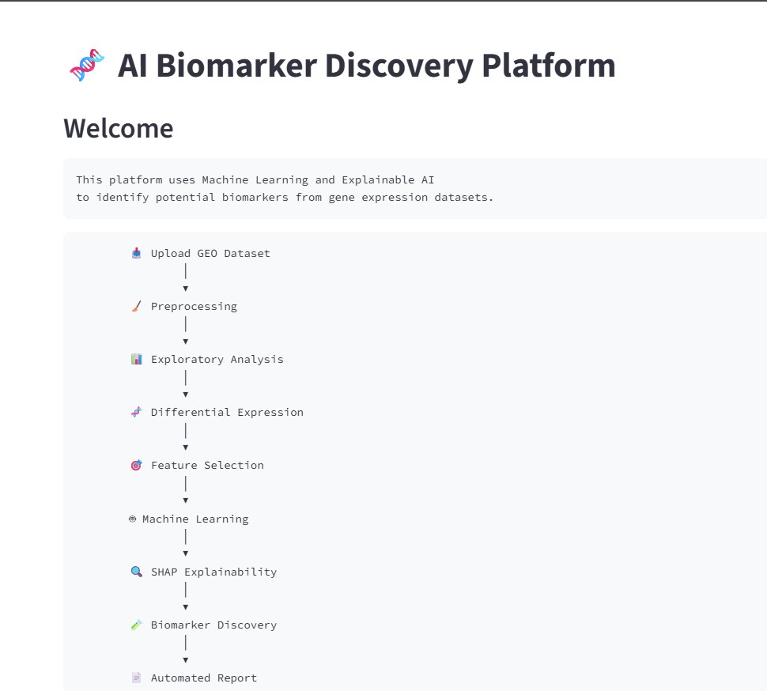
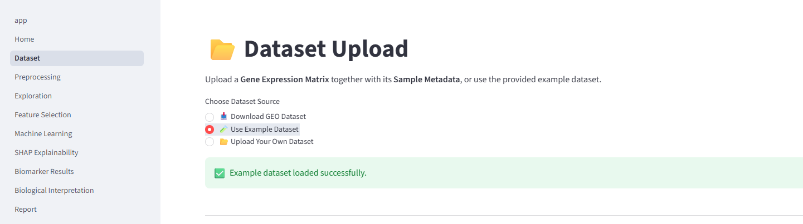
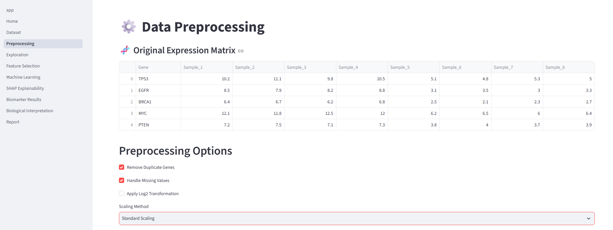
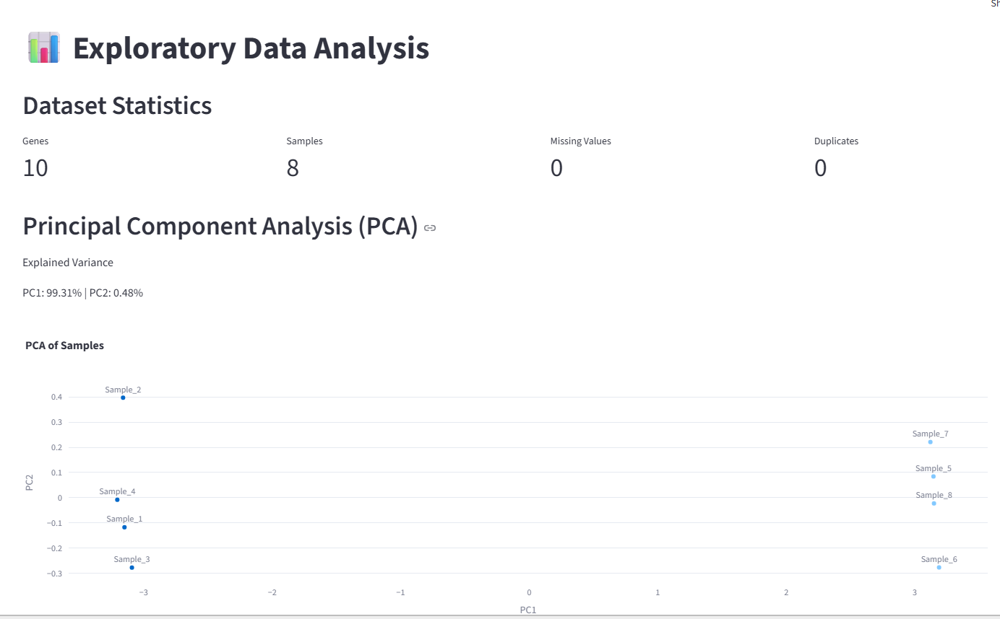
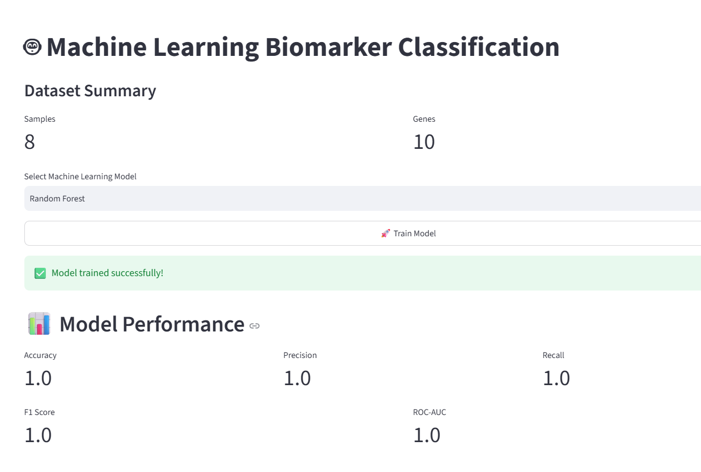
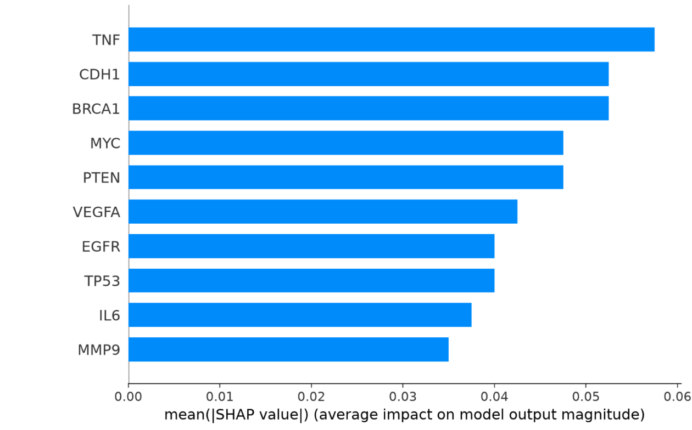
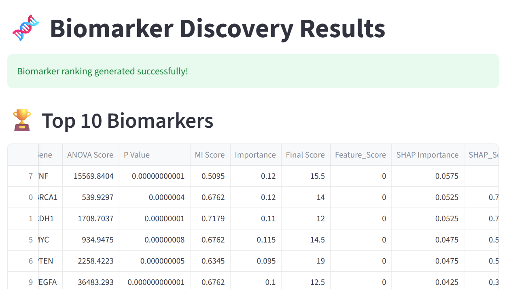
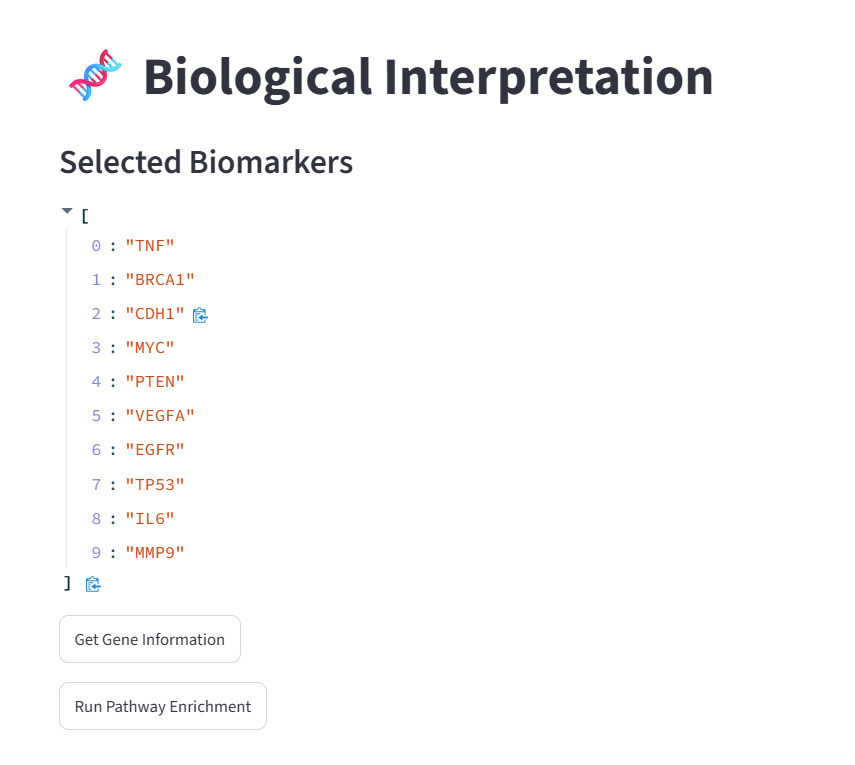
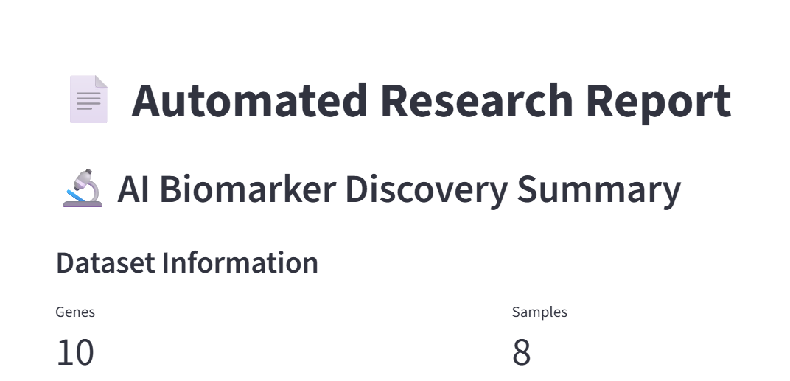

<div align="center">
  
# 🧬 AI Biomarker Discovery Platform


</div>

<div align="center">
An end-to-end **AI-powered biomarker discovery platform** that integrates bioinformatics, machine learning, and explainable AI to identify potential disease-associated biomarkers from gene expression data.

The platform allows researchers to upload or automatically retrieve public gene expression datasets, perform preprocessing, train machine learning models, interpret predictions using SHAP explainability, and generate biological insights.
---
</div>

# 🚀 Project Overview

Finding reliable biomarkers from high-dimensional genomic data is challenging because gene expression datasets contain thousands of features (genes) but limited samples.

This project aims to build an automated workflow:



---

# ✨ Features

## 📂 Dataset Management



Supports:

- User-uploaded gene expression matrices
- Sample metadata upload
- Example datasets
- GEO accession-based dataset retrieval

Currently supports:

- GEO datasets (GSE accession)
- CSV expression matrices
- CSV metadata files

---

## 🧬 Gene Expression Processing

Pipeline includes:

- Expression matrix loading
- Sample validation
- Metadata matching
- Data preprocessing
- Gene feature handling
- Dataset quality checks



---

## 🔍 Exploratory Analysis

Includes:

- Gene expression visualization
- PCA analysis
- Sample clustering
- Distribution analysis



---

## 🤖 Machine Learning

Implemented models:

- Random Forest Classifier
- Logistic Regression

The models learn patterns between:

```
Gene Expression → Disease State
```


---

## 🔬 Explainable AI

Uses SHAP (SHapley Additive exPlanations) to understand model decisions.

Provides:

- Global feature importance
- Top biomarker candidates
- SHAP summary plots
- SHAP ranking of important genes



---

## 🧪 Biomarker Discovery

The platform ranks candidate biomarkers using machine learning feature importance and SHAP explainability.

Outputs include:

- Ranked biomarkers
- Feature importance
- Expression comparison
- Biomarker confidence scores



---

## 🌿 Biological Interpretation

Interpret discovered biomarkers using biological knowledge.

Future support includes:

- Gene Ontology (GO)
- KEGG Pathways
- Functional Annotation
- Disease Association



---

## 📄 Automated Research Report

Generate a downloadable report containing:

- Dataset summary
- Quality control statistics
- PCA visualization
- Differentially expressed genes
- Machine learning performance
- SHAP explainability
- Ranked biomarker candidates
- Biological interpretation


<p align="center">
  
</p>
---

## 🧪 GEO Dataset Integration

The platform can automatically:

- Download GEO datasets 
- Extract expression matrices
- Extract sample metadata
- Detect experimental groups
- Prepare data for downstream analysis

## Supported GEO Datasets

The current version of this platform supports GEO studies that provide a processed gene expression matrix (Series Matrix).

Supported:
- Microarray expression datasets
- Processed expression matrices available through GEO

Currently not supported:
- Raw RNA-seq FASTQ files
- Supplementary count files only
- Single-cell RNA-seq datasets
- GEO studies requiring external preprocessing

Future versions will include automated processing of RNA-seq count matrices and expanded support for additional transcriptomic data formats.

The platform can automatically:

- Download GEO datasets 
- Extract expression matrices
- Extract sample metadata
- Detect experimental groups
- Prepare data for downstream analysis

Example:

```
GEO Accession
       │
       ▼
Automatic Download
       │
       ▼
Expression Matrix
       │
       ▼
Automatic Metadata Extraction
       │
       ▼
Preprocessing
       │
       ▼
Machine Learning
       │
       ▼
Biomarker Discovery
```
---

# 🏗️ Project Architecture

```
AI_Biomarker_Discovery/

│
├── app.py
│
├── pages/
│   ├── 1_Home.py
│   ├── 2_Dataset.py
│   ├── 3_Preprocessing.py
│   ├── 4_Exploration.py
│   ├── 5_Feature_Selection.py
│   ├── 6_Machine_Learning.py
│   ├── 7_SHAP_Explainability.py
│   ├── 8_Biomarker_Results.py
│   ├── 9_Biological_Interpretation.py
│   └── 10_Report.py
│
├── utils/
│   ├── data_loader.py
│   ├── preprocessing.py
│   ├── feature_selection.py
│   ├── models.py
│   ├── shap_analysis.py
│   ├── geo_downloader.py
│   ├── visualization.py
│   ├── biology.py
│   ├── biomarker_ranking.py
│   └── report.py
│
├── data/
├── report.py/
├── requirements.txt
├── assets/
|
└── README.md
```
---

# 🛠️ Tech Stack

## Programming

- Python 3.12+

## Bioinformatics

- GEOparse
- Gene expression analysis
- Genomic datasets

## Machine Learning

- Scikit-learn
- Random Forest
- Logistic Regression

## Explainable AI

- SHAP

## Data Processing

- Pandas
- NumPy

## Visualization

- Matplotlib
- Streamlit

## Report Generation

- ReportLab

---

# 📊 Input Data Format

## Expression Matrix

Example:

| Gene | Sample_1 | Sample_2 | Sample_3 |
|---|---|---|---|
| TP53 | 10.2 | 12.5 | 8.4 |
| EGFR | 5.6 | 7.2 | 2.3 |

Format:

```
Gene → First column
Samples → Remaining columns
```

---

## Metadata File

Example:

| Sample | Group |
|---|---|
| Sample_1 | Control |
| Sample_2 | Control |
| Sample_3 | Disease |

Sample names must match expression matrix columns.

---

# ⚙️ Installation

Clone repository:

```bash
git clone https://github.com/Bano733-code/AI-Biomarker-Discovery.git
```

Navigate:

```bash
cd AI-Biomarker-Discovery
```

Create environment:

```bash
python -m venv venv
```

Activate environment:

Windows:

```bash
venv\Scripts\activate
```

Linux/Mac:

```bash
source venv/bin/activate
```

Install dependencies:

```bash
pip install -r requirements.txt
```

---

# ▶️ Run Application

Start Streamlit:

```bash
streamlit run app.py
```

The application will open in your browser.

---

# 📈 Future Improvements

Planned improvements:

- Differential expression analysis
- GO and KEGG pathway enrichment
- Gene ontology annotation
- Biological network visualization
- RNA-seq normalization workflows
- Deep learning models
- Automated research report generation
- Integration with additional biological databases

---

# 🎯 Motivation

This project explores the application of:

- Machine Learning
- Explainable AI
- Computational Biology
- Genomics

for discovering interpretable biomarkers from high-dimensional biological datasets.

---

# 👩‍💻 Author

**Bano Rani**

BS Bioinformatics Student  
Research Interests:

- Machine Learning in Bioinformatics
- Computational Biology
- Genomics
- Precision Medicine
- AI-driven Drug Discovery

---

# ⭐ Acknowledgements

Data sources:

- NCBI Gene Expression Omnibus (GEO)
- Public genomic datasets

Libraries:

- Scikit-learn
- SHAP
- Streamlit
- GEOparse
